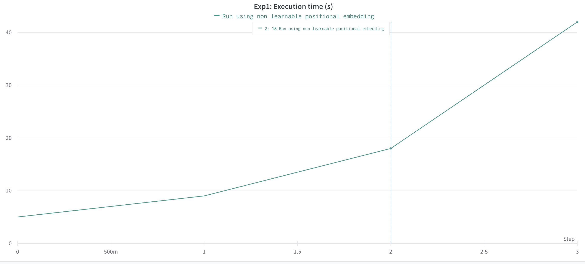
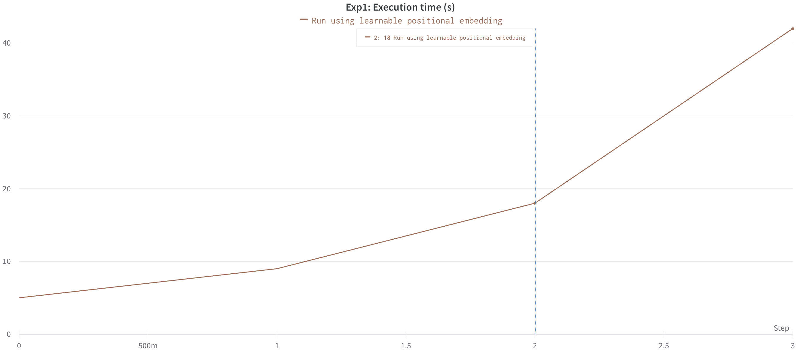
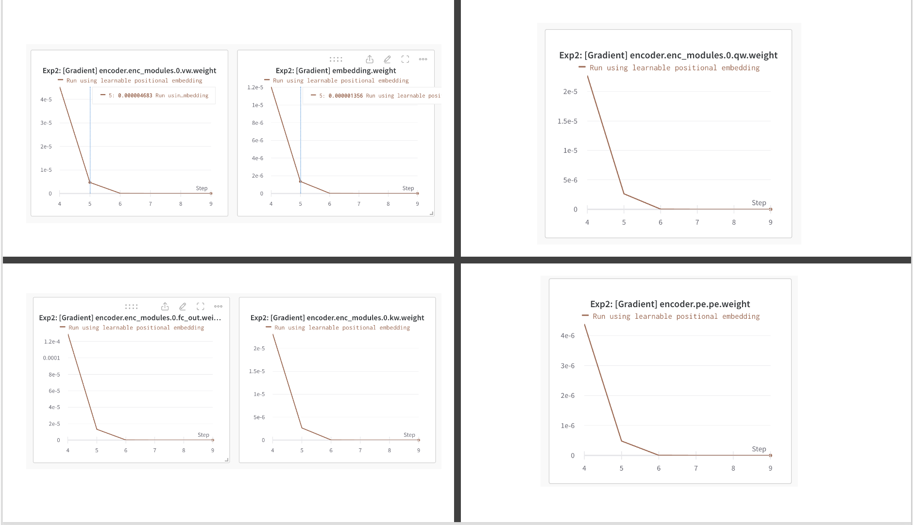

## Environment Setup

Wandb setup information

1. Make sure `WANDB_API_KEY` is set

2. Or, in `main.py`. Make sure to add wandb api key
   ```python
   wandb.login(key="")
   ```

To set up the conda environment for this project, do the following

1. Open a terminal or command prompt.

2. Navigate to the directory where the YAML file is located.

3. Run the following command to create the conda environment:

   ```shell
   conda env create -f environment.yml
   ```

Experiments run on:

- python: Python 3.8.16
- GPU Conf:
  - CUDA Version: 10.1
  - Nvidia Quadro P6000
  - RAM: 24 GB

## Questions

1. Suppose that we design a deep architecture to represent a sequence by stacking self-attention layers with positional encoding. What could be issues?

- **Hypothesis 1**: As we increase the number of multi-head self-attention layers, the overall.computing should be computationally expensive. Since, the self-attention operation has a quadratic
  time complexity concerning the sequence length. I expect to observe prohibitively slower
  performance or requirement of significant computational resources for longer sequences.

  - **Experiment Setup** To verify this hypothesis. I have created a dummy classifer which takes in a dummy dataset
    generated for a number of input sequences to which a deep net architecture of stacked Multi-Head
    Attention layers is constructed. Positional encoding - both learnable and non-learnable(as presented in the original transformers paper) is used.

  - **Results**
    
    

    | Input Sequence Length | Run Time (s) |
    | --------------------- | ------------ |
    | 64                    | 5            |
    | 128                   | 9            |
    | 256                   | 18           |
    | 512                   | 42           |

    Based on these results we can conclude that as we stack more MHA layers, we see increase in the overall computing complexity as stated in the hypothesis. Please note: My GPU could only support input sequences upto 512.

- Hypothesis 2: Only stacking Multi-head attention layers might result in a
  vanishing gradient problem. The original transformer paper used MHA in conjecture with
  Residual connections. Hence, I hope to see average gradient value per layer become smaller
  and smaller as gradients flow toward the initial layers.

  - **Experiment Setup** To verify this hypothesis. I have created a dummy classifer which takes in a dummy dataset generated for a fixed number of input sequences to which a deep net architecture of varied stacked Multi-Head Attention layers is constructed. Positional encoding - both learnable and non-learnable(as presented in the original transformers paper) is used. mean avg. gradients for initial layers, token embedding and learnable Positional encoding embedding is logged. The below shows the results when learnable position encoding is used

  - **Results**
    

    The graphs shown are mean abs gradient for the lower encoder layer. We can see that the mean abs gradient value decreases as we stack more MHSA layers

**Apart from these hypotheses. There are multiple other factors which might arise:**

- The model becoming too complex which might cause overfitting
- Memory requirements for storing self attention layers, this was mentioned partially in the video
  demo where I mentioned my GPU couldn't support more than 512 seq length and more than 64 stacked layers

A better comparison can be done using an actual dataset.

2. Can you design a learnable positional encoding method?

   Although there might be different methods in literature to generate learnable positional encodings. The simplest is to use `torch.nn.Embedding` which uses a simple lookup table that stores embeddings of a fixed dictionary and size. We can use this by using `seq len` param value for the `num_embeddings` argument. This is a learnable parameter meaning `requires_grad=True` and hence would be updated during backpropagation.

   Since, the original intent of the problem statement was not to run on an actual dataset, I have assumed a dummy dataset to test the above. The `LearnablePositionalEncoding` does get updated during backpropagation but to concretely see whether it is comparable to non-learnable Positional encoding, I'd need to test it on an actual dataset. Due to time constraints I haven't been able to do so.

   ```python
   class LearnablePositionalEncoding(torch.nn.Module):
    def __init__(self, seq_len, in_dim, dropout_p=0.1) -> None:
        """
        Learnable positional encoding layer.

        Parameters:
        - seq_len (int): The length of the input sequence.
        - in_dim (int): The input dimension.
        - dropout_p (float, optional): The dropout probability. Defaults to 0.1.
        """
        super(LearnablePositionalEncoding, self).__init__()
        self.dropout = torch.nn.Dropout(dropout_p)
        self.positions = torch.arange(seq_len).unsqueeze(0)
        self.pe = torch.nn.Embedding(seq_len, in_dim)

    def forward(self, x):
        """
        Forward pass of the learnable positional encoding layer.

        Parameters:
        - x (torch.Tensor): The input tensor.

        Returns:
        - torch.Tensor: The output tensor after adding positional encoding.
        """
        x = x + self.pe(self.positions.to(x.device))
        out = self.dropout(x)
        return out
   ```

## How to use script to replicate results

### Shell File: `run.sh` under scripts

### Usage

1. Open terminal.

2. Navigate to scripts containing the `run.sh` file.

3. Run the following command:

   ```bash
   chmod +x run.sh
   ```

4. Run

   ```bash
   ./run_script.sh
   ```

### Command-line Arguments

The following command-line arguments can be used:

- `--num_texts`: The number of texts (default: 1000)
- `--run_name`: The name of the run (default: "Run using non-learnable positional embedding")
- `--batch_size`: The batch size (default: 32)
- `--seq_lens`: The sequence lengths to consider (default: 64 128 256 512)
- `--fixed_self_attn_layers`: The fixed number of self-attention layers (default: 8)
- `--fixed_seq_len`: The fixed sequence length (default: 64)
- `--self_attn_layers`: The variable number of self-attention layers (default: 2 4 8 16 32 64)
- `--pe_learnable`: Flag to enable learnable positional encoding (commented out by default)

Note: You can comment out the `--pe_learnable` flag to use the default non-learnable positional encoding.

## References

1. Attention Is All You Need: https://arxiv.org/abs/1706.03762
